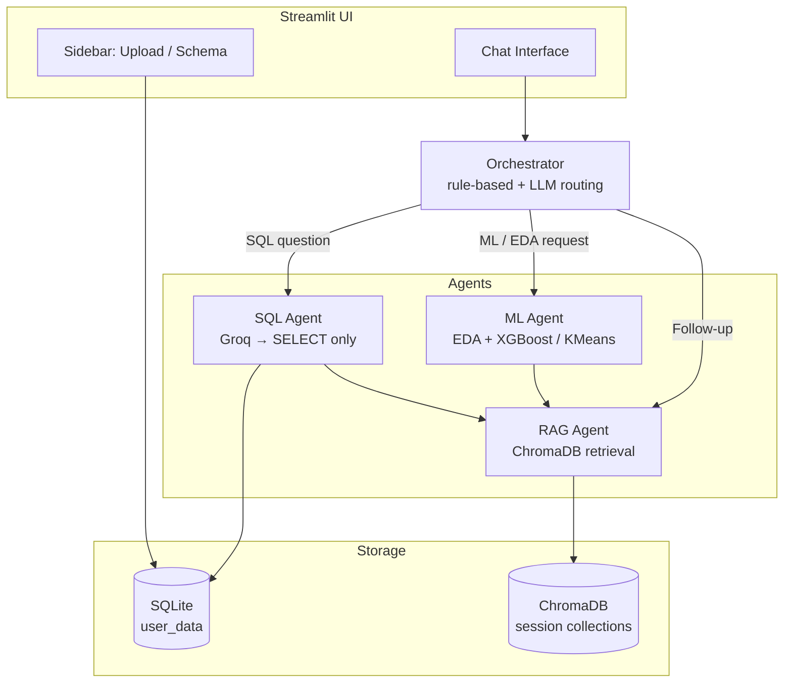

# Agentic Data Analyst

[](https://www.python.org/)
[](https://streamlit.io/)
[](https://groq.com/)
[](LICENSE)

Upload a CSV, ask questions in plain English, and get SQL answers, automated ML analysis, and RAG-powered follow-ups — all from a single chat interface.

## Business Problem & Solution

### The problem

Business teams sit on valuable data — CSV exports, CRM dumps, billing tables — but most stakeholders can't write SQL. Every small question (*"How many customers churned this month?"*, *"What's our average deal size?"*) has to go through a data analyst. That creates bottlenecks, slows decisions, and burns analyst time on repetitive queries instead of deeper work.

Worse, once an analysis or report is delivered, it's static. Ask a follow-up a week later and the whole exercise often starts over.

### The solution

**Agentic Data Analyst** gives any team member — no SQL or ML background required — a single chat interface over their data:

1. **Natural-language SQL** — quick facts and aggregations on demand
2. **Automated ML** — predictive answers (e.g. *who is likely to churn?*)
3. **RAG follow-up chat** — past insights stay queryable; analysis becomes a living conversation, not a one-time PDF

### Example: SaaS customer retention

A retention manager uploads `customer_churn.csv` and works through a realistic workflow:

| Step | What they ask | What happens |
|------|---------------|--------------|
| 1 | *"How many customers churned?"* | SQL agent returns the count instantly — no analyst ticket |
| 2 | *"Train a model to predict which customers are at risk"* | ML agent runs EDA, trains a classifier, surfaces at-risk patterns |
| 3 | *"Why are these customers churning? What should we do?"* | RAG agent pulls from prior SQL + ML results and gives grounded recommendations |

Same day: facts, predictions, and actionable follow-ups — without a single line of SQL.

### Who it's for

- **Managers & founders** who need fast, self-serve answers from their own data
- **Analysts & engineers** who want a reusable agentic pattern (SQL + ML + RAG behind one orchestrator) they can point at other datasets

> **Portfolio note:** The bundled sample datasets are intentionally small (~25–30 rows) so you can demo the full pipeline quickly. ML metrics (accuracy, R², silhouette score) illustrate the workflow — they are **not** production-grade model performance. Use your own datasets for meaningful evaluation.

---

## Overview

**Agentic Data Analyst** is a multi-agent Streamlit app that turns tabular data into an interactive analysis workspace:

1. **Ingest** — Upload a CSV; column names are cleaned, types inferred, and data loaded into SQLite.
2. **Query** — Ask natural-language questions; a SQL agent generates safe `SELECT`-only queries via Groq LLM.
3. **Analyze** — An ML agent auto-detects classification, regression, or clustering, runs EDA, trains models, and reports metrics.
4. **Remember** — EDA/ML/SQL outputs are chunked and embedded in ChromaDB for grounded follow-up Q&A (RAG).
5. **Route** — An orchestrator classifies each message and dispatches it to the right agent.

---

## Architecture



```
┌──────────────────────────────────────────────────────────────┐
│                   Streamlit UI (app.py)                       │
│     Sidebar: upload · schema        Main: unified chat        │
└────────────────────────────┬─────────────────────────────────┘
                             │
                  ┌──────────▼──────────┐
                  │    Orchestrator     │
                  │  classify → route   │
                  └──────────┬──────────┘
         ┌───────────────────┼───────────────────┐
         ▼                   ▼                   ▼
   ┌───────────┐      ┌────────────┐      ┌────────────┐
   │ SQL Agent │      │  ML Agent  │      │ RAG Agent  │
   │ Groq LLM  │      │ sklearn/XGB│      │  ChromaDB  │
   │ SQLite    │      │ Plotly EDA │      │  MiniLM    │
   └───────────┘      └────────────┘      └────────────┘
```

---

## Tech Stack

| Layer | Technology |
|-------|------------|
| **Frontend** | Streamlit |
| **Database** | SQLite + SQLAlchemy |
| **ML** | pandas, scikit-learn, XGBoost |
| **Vector DB** | ChromaDB (persistent, local) |
| **Embeddings** | HuggingFace `all-MiniLM-L6-v2` |
| **LLM** | Groq `llama-3.3-70b-versatile` |
| **Charts** | Plotly |
| **Config** | python-dotenv (`.env` in project root) |

---

## Quick Start

### Prerequisites

- Python 3.11 or newer
- A free [Groq API key](https://console.groq.com/)

### 1. Clone and install

```bash
git clone <your-repo-url>
cd agentic-data-analyst
python -m venv venv

# Windows
venv\Scripts\activate
# macOS / Linux
source venv/bin/activate

pip install -r requirements.txt
```

### 2. Configure API key (recommended)

```bash
# macOS / Linux
cp .env.example .env

# Windows
copy .env.example .env
```

Edit `.env` and replace the placeholder:

```env
GROQ_API_KEY=gsk_your_actual_key_here
```

The app loads this automatically — no need to set PowerShell `$env:` each session.

### 3. Run locally

```bash
python -m streamlit run app.py
```

Open [http://localhost:8501](http://localhost:8501).

### 4. Try it

Select a sample dataset from the sidebar, then ask:

| Type | Example prompt |
|------|----------------|
| SQL | *"How many customers churned?"* |
| ML | *"Train a model to predict churn"* |
| RAG | *"What were the key findings?"* (after prior queries) |

---

## Sample Data

| File | Rows | Task type | Target column |
|------|------|-----------|---------------|
| `sample_data/customer_churn.csv` | 30 | Classification | `churn` |
| `sample_data/house_prices.csv` | 25 | Regression | `price` |

These files exist to demonstrate ingestion → SQL → ML → RAG end-to-end. Expect high variance in metrics at this scale.

---

## Project Structure

```
agentic-data-analyst/
├── app.py                  # Streamlit entrypoint
├── agents/
│   ├── ingestion.py        # CSV → SQLite
│   ├── sql_agent.py        # Text-to-SQL + safety guard
│   ├── ml_agent.py         # EDA + auto ML
│   ├── rag_agent.py        # ChromaDB RAG
│   ├── orchestrator.py     # Query routing
│   └── llm_client.py       # Groq client
├── db/database.py          # SQLAlchemy helpers
├── utils/
│   ├── env.py              # .env loading (project root)
│   ├── chunking.py         # RAG text chunking
│   └── charts.py           # Plotly EDA charts
├── sample_data/            # Demo CSVs
├── self_test.py            # End-to-end test script
├── requirements.txt        # Pinned dependencies
├── .env.example            # API key template (committed)
├── DECISIONS.md            # Design decisions log
└── FINAL_REPORT.md         # Build summary
```

---

## Deployment (Streamlit Community Cloud)

1. Push this repo to GitHub (do **not** commit `.env`).
2. Go to [share.streamlit.io](https://share.streamlit.io) → **New app** → select repo, branch, `app.py`.
3. Under **Advanced settings → Secrets**, add:

   ```toml
   GROQ_API_KEY = "gsk_your_actual_key_here"
   ```

4. Deploy. First RAG use downloads the embedding model (~90 MB).

For other hosts (Railway, Fly.io, Docker), set `GROQ_API_KEY` as an environment variable or mount a `.env` file.

---

## Safety & Guardrails

- Only `SELECT` SQL is executed — `INSERT`/`UPDATE`/`DELETE`/`DROP` are blocked by regex
- Missing or placeholder API key shows a sidebar warning; the app does not crash
- Errors are caught and surfaced inline in chat

---

## Development

```bash
# Run self-tests (LLM tests skipped without a valid GROQ_API_KEY)
python self_test.py
```

---

## License

[MIT](LICENSE)